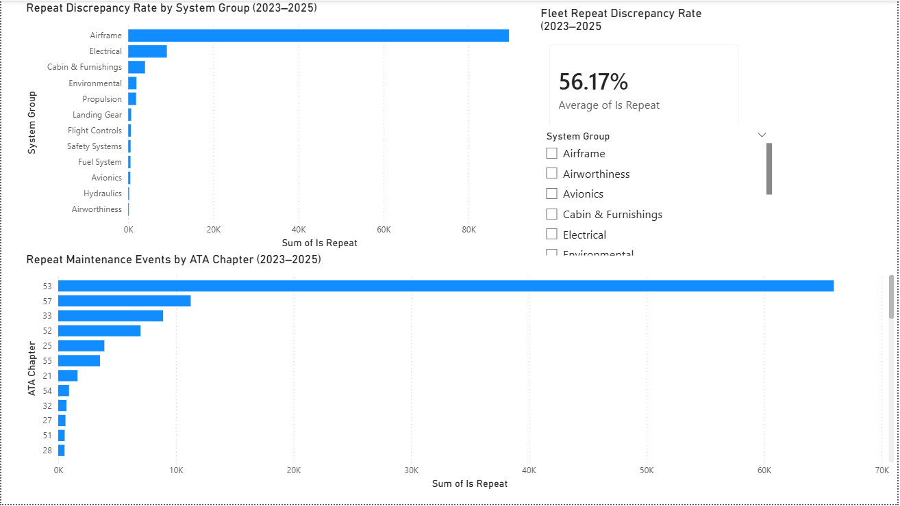
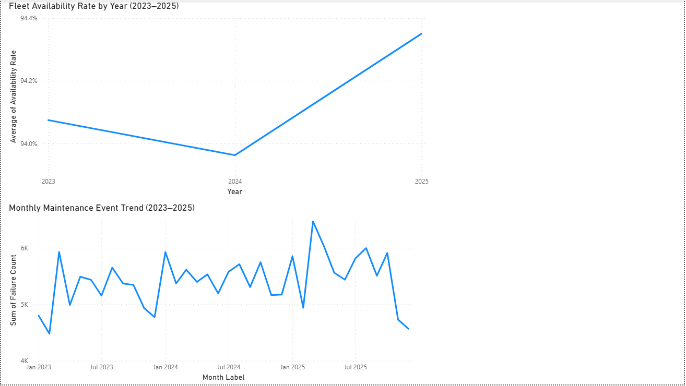
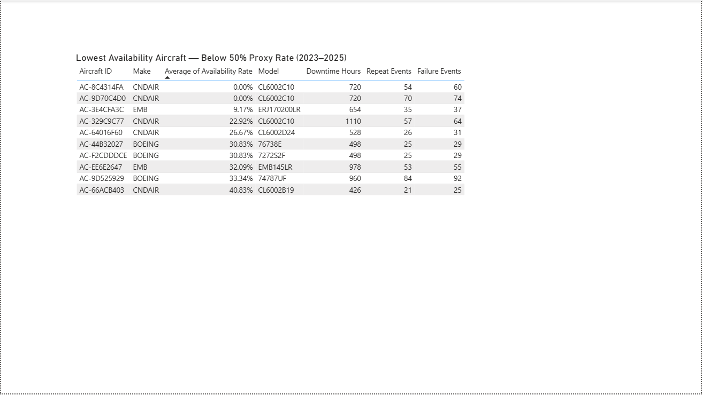

# Aircraft Readiness Analytics Dashboard


> End-to-end aviation maintenance analytics project turning **194,844 public FAA Service Difficulty Reports** into a repeat-discrepancy model, a SQLite analytics layer, and a **3-page Power BI dashboard** for maintenance burden analysis.



## 30-second read

**Problem:** maintenance leaders do not just need event counts; they need to know which discrepancies keep coming back, where burden is concentrated, and which patterns deserve investigation.  
**What I built:** Python ETL → normalized event model → SQLite views → Power BI dashboard with repeat-discrepancy logic and a documented availability proxy.  
**What it found:** in this public SDR dataset, **ATA 53 / Fuselage** produced **75,690 events** with an **87.1% repeat-discrepancy rate**; **Airframe** systems repeated at **74.2%** versus **13.5%** for **Hydraulics**.

## Why this project matters

This is the kind of analysis maintenance organizations actually need: not a pretty chart detached from operations, but a workflow that moves from messy public records to a decision-ready view of recurring burden. It is intentionally built around aviation concepts — ATA chapters, repeat discrepancies, readiness-style KPIs, and operational caveats — because good analytics should respect the shape of the domain it serves.

For a hiring manager, this project demonstrates four things at once:

- aviation maintenance fluency
- data engineering discipline
- Power BI storytelling
- restraint about what the data can and cannot prove

## Dashboard preview

| Page 1 — recurring burden | Page 2 — trend analysis |
| --- | --- |
|  |  |

| Page 3 — aircraft drill-down | Full dashboard file |
| --- | --- |
|  | [`powerbi/aircraft_readiness.pbix`](powerbi/aircraft_readiness.pbix) |

The Power BI file is organized as a compact analyst workflow:

| Dashboard page | Primary question | Typical decision supported |
| --- | --- | --- |
| Fleet overview | Where is the maintenance burden concentrated? | Prioritize systems for review |
| Trend analysis | Is the burden changing over time? | Separate persistent issues from one-off spikes |
| Aircraft detail | Which aircraft deserve drill-down? | Identify candidates for deeper maintenance investigation |

See the fuller walkthrough in [`docs/dashboard_walkthrough.md`](docs/dashboard_walkthrough.md).

## Business questions answered

1. Which ATA chapters generate the largest maintenance burden?
2. Which systems show the highest repeat-discrepancy rates?
3. Is the maintenance burden improving, worsening, or staying flat over time?
4. Which aircraft cluster near the bottom of the availability proxy?
5. What additional data would be required before making a true operational-readiness claim?

## Key findings

| Finding | Evidence | Why it matters |
| --- | --- | --- |
| **Fuselage dominates recurring burden** | ATA 53: **75,690 events**, **87.1% repeat rate** | Structural issues are the clearest recurring signal in the dataset |
| **Airframe systems repeat far more often than hydraulic systems** | Airframe **74.2%** vs Hydraulics **13.5%** | Helps separate chronic structural burden from lower-repeat mechanical categories |
| **The burden persists across the period** | Avg availability proxy: **94.1% → 94.0% → 94.4%** from 2023–2025 | Volume rises while the proxy remains broadly flat |
| **Certain aircraft families warrant investigation** | 5 of the 10 lowest proxy performers are Canadair CL600-series aircraft | Useful lead for follow-up analysis with richer operator data |

The careful version matters: these are **directional findings from public SDR data**, not official claims about real fleet readiness. The project documents that distinction in [`docs/ASSUMPTIONS_AND_LIMITATIONS.md`](docs/ASSUMPTIONS_AND_LIMITATIONS.md).

## How it works

```text
FAA SDR CSVs (2023–2025)
        │
        ▼
extract_sdr.py
        │
        ▼
clean_sdr.py
  - parse dates
  - deduplicate events
  - anonymize tail numbers
  - flag 30-day repeats
        │
        ▼
normalize_components.py
  - map ATA chapters
  - group systems
        │
        ▼
build_fact_table.py
  - create monthly readiness proxy
  - build dimensions
        │
        ▼
export_powerbi_csv.py
        │
        ├──────────────► SQLite analytics layer
        │
        └──────────────► Power BI dashboard
```

## Skills demonstrated

| Capability | Evidence in this repo |
| --- | --- |
| ETL development | Multi-step Python pipeline in [`etl/`](etl/) |
| Data modeling | Fact/dimension exports for Power BI and SQLite views |
| SQL analytics | KPI queries and reusable views in [`sql/`](sql/) |
| Power BI development | `.pbix` file plus documented DAX measures |
| Domain reasoning | ATA mapping, repeat-discrepancy heuristic, readiness proxy caveats |
| Documentation | Findings, methodology, assumptions, and data dictionary |

## Repository map

```text
aircraft-readiness-dashboard/
├── data/
│   ├── raw/                      # FAA SDR source files
│   └── processed/                # Cleaned data, Power BI exports, SQLite database
├── docs/
│   ├── screenshots/              # Visual outputs used in the README
│   ├── ASSUMPTIONS_AND_LIMITATIONS.md
│   ├── dashboard_walkthrough.md
│   ├── data_dictionary.md
│   ├── findings.md
│   └── methodology.md
├── etl/
│   ├── extract_sdr.py
│   ├── clean_sdr.py
│   ├── normalize_components.py
│   ├── build_fact_table.py
│   └── export_powerbi_csv.py
├── powerbi/
│   ├── aircraft_readiness.pbix
│   └── dax_measures.txt
├── sql/
│   ├── kpi_queries.sql
│   ├── load_db.py
│   ├── schema.sql
│   ├── validation_queries.sql
│   └── views.sql
└── tests/
```

## Reproduce the pipeline

```bash
pip install -r requirements.txt

python etl/extract_sdr.py
python etl/clean_sdr.py
python etl/normalize_components.py
python etl/build_fact_table.py
python etl/export_powerbi_csv.py
python sql/load_db.py
python -m pytest -q
```

## Evidence pack

- [`docs/findings.md`](docs/findings.md) — written findings with supporting tables
- [`docs/methodology.md`](docs/methodology.md) — how the analysis was built
- [`docs/data_dictionary.md`](docs/data_dictionary.md) — final Power BI / SQLite field definitions
- [`docs/ASSUMPTIONS_AND_LIMITATIONS.md`](docs/ASSUMPTIONS_AND_LIMITATIONS.md) — what the data does **not** support
- [`powerbi/dax_measures.txt`](powerbi/dax_measures.txt) — dashboard measures

## Data source

**FAA Service Difficulty Reporting System (SDRS)**  
- public civil-aviation maintenance dataset
- reporting years analyzed: **2023, 2024, 2025**
- events analyzed: **194,844**
- unique aircraft identifiers after anonymization: **12,226**

All registration numbers are replaced with stable synthetic aircraft IDs before downstream analysis.

## About the analyst

**Richard Hankins**  
Aviation Maintenance Team Lead — U.S. Army | BBA Candidate (4.0 GPA) | Active Secret Clearance

Six years supervising Black Hawk maintenance taught me that the useful question is rarely “what happened?” It is “what keeps happening, what does it cost us, and what should leadership look at next?” This project is my translation of that operational mindset into civilian aviation analytics.

I am especially interested in aviation data analyst roles where maintenance knowledge, Power BI, SQL, and practical decision support meet.

[LinkedIn](https://linkedin.com/in/richardhankinsjr) · [GitHub](https://github.com/RichHank)
